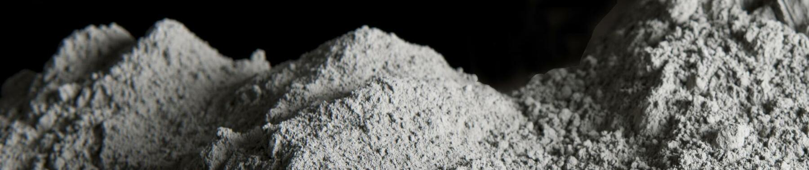

# Kaggle_S3_09


## Tabular Regression with a Concrete Strength Dataset

<br>


-   Title           : Tabular Regression with a Concrete Strength Dataset
-   Problem type    : Regression
-   Time Limit      : 14 days
-   Team members    : Solo
-   Total teams     : 765
-   Final Ranking   : # 21

<p align="center">
  
</p>

<br>

### My approach summary:

- Plot the overview of the data (EDA) : Correlation, distribution of dataset, number of missing rows, etc.

- Filters columns, and applies feature engineering (with help from ChatGPT) to create new features.

- Approach 1 (Simple split):
    - Simple train/test split approach
    - Fits the (XGBoost, CatBoost, LightGBM) regressor models on the training set, and scores the predicted model based on test set using RMSE.

<br>

- Approach 2 (K-Fold Cross-Validation approach):
    - Uses K-Fold CV (n_splits = 5). I.e. At a time, 1/5th of the dataset is used for testing (rest for training), and this is repeated 5 times in total for each fifth of the dataset.
    - Fits the (XGBoost, CatBoost, LightGBM) regressor models on the training set, and scores the predicted model based on test set using RMSE.

<br>

- Approach 3a (Ensemble learning ~ Tuning model + average outputs):
    - Model tuning involved Grid Search or Bayesian Optimisation *(Grid search brute forces all parameters to search, whilst Bayesian Optimisation uses a probabilistic model)* to find the best hyperparameters for the model.

        - Used Bayesian Optimisation for XGB
        - Used Bayesian Optimisation for LightGBM
        - Used Grid Search for CatBoost (since there were only 2 parameters)

    - Fitted and predicted with each regressor model, and calculated the average for the three models.

<br>

- Approach 3b (Ensemble learning ~ Tuning model + average output + N_copies):
    - Similar to above, however on top of that, different random states were used during fitting, in order to capture the different sources of randomness to reduce variance in the prediction to have a more robust and accurate model. The outputs from each different states were then also averaged.


<br></br>


Competition:
```playground-series-s3e9,
    author = {Ashley Chow, inversion, Walter Reade},
    title = {Playground Series - Season 3, Episode 9},
    publisher = {Kaggle},
    year = {2023},
    url = {https://kaggle.com/competitions/playground-series-s3e9}
```


